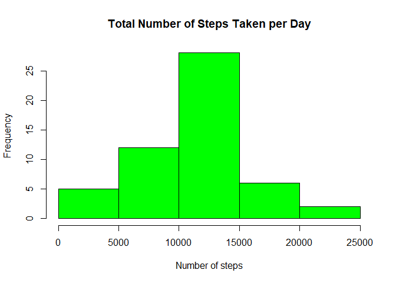
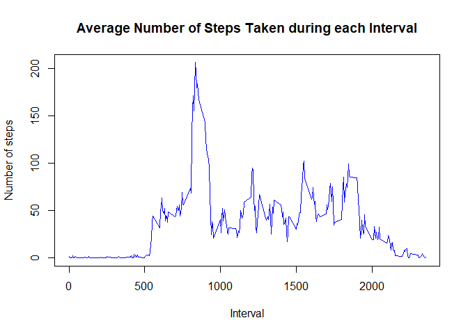
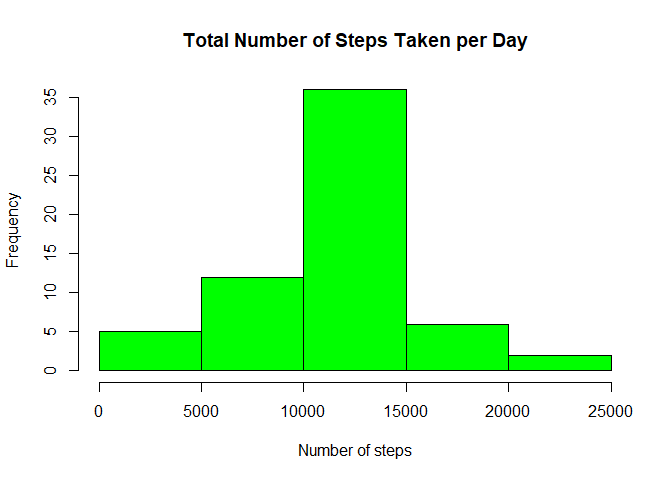
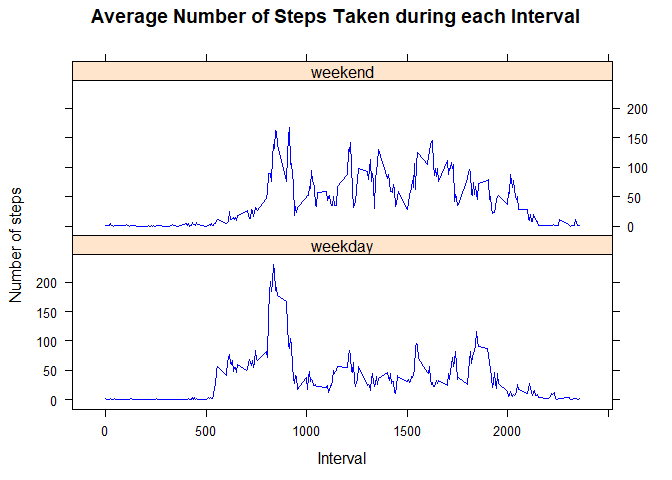

Load required packages

```r
library(knitr)
library(tidyverse)
```

```
## -- Attaching packages ----------------------------------------------------------------------------------------- tidyverse 1.2.1 --
```

```
## v ggplot2 3.2.1     v purrr   0.3.2
## v tibble  2.1.3     v dplyr   0.8.3
## v tidyr   0.8.3     v stringr 1.4.0
## v readr   1.3.1     v forcats 0.4.0
```

```
## -- Conflicts -------------------------------------------------------------------------------------------- tidyverse_conflicts() --
## x dplyr::filter() masks stats::filter()
## x dplyr::lag()    masks stats::lag()
```

```r
library(lattice)
```


Set default to be echo = TRUE

```r
opts_chunk$set(echo = TRUE)
```

Set format of numbers

```r
options(digits = 2, scipen = 10)
```

## Loading and preprocessing the data

Unzip the folder containing the data

```r
unzip("activity.zip")
```

Read in the data

```r
activity_data <- read_csv("activity.csv")
```

```
## Parsed with column specification:
## cols(
##   steps = col_double(),
##   date = col_date(format = ""),
##   interval = col_double()
## )
```

View the first few rows of the data

```r
head(activity_data)
```

```
## # A tibble: 6 x 3
##   steps date       interval
##   <dbl> <date>        <dbl>
## 1    NA 2012-10-01        0
## 2    NA 2012-10-01        5
## 3    NA 2012-10-01       10
## 4    NA 2012-10-01       15
## 5    NA 2012-10-01       20
## 6    NA 2012-10-01       25
```

## What is mean total number of steps taken per day?

Group the data by day. Find the total steps taken on each day (excluding missing values)

```r
steps_per_day <- activity_data %>%
  na.omit() %>%
  group_by(date) %>%
  summarise(total_steps = sum(steps))
steps_per_day
```

```
## # A tibble: 53 x 2
##    date       total_steps
##    <date>           <dbl>
##  1 2012-10-02         126
##  2 2012-10-03       11352
##  3 2012-10-04       12116
##  4 2012-10-05       13294
##  5 2012-10-06       15420
##  6 2012-10-07       11015
##  7 2012-10-09       12811
##  8 2012-10-10        9900
##  9 2012-10-11       10304
## 10 2012-10-12       17382
## # ... with 43 more rows
```

Construct a histogram of the total number of steps taken each day

```r
hist(steps_per_day$total_steps,
     col = "green",
     main = "Total Number of Steps Taken per Day",
     xlab = "Number of steps",
     ylab = "Frequency")
```

<!-- -->

Calculate the mean and median number of steps taken in a day

```r
mean_steps <- mean(steps_per_day$total_steps)
median_steps <- median(steps_per_day$total_steps)
```

The mean number of steps taken per day is 10766.19 steps.  
The median number of steps taken per day is 10765 steps.

## What is the average daily activity pattern?

Find the average number of steps taken at each interval (exluding missing values)

```r
intervals <- activity_data %>%
  na.omit() %>%
  group_by(interval) %>%
  summarise(avg_steps = mean(steps))
intervals
```

```
## # A tibble: 288 x 2
##    interval avg_steps
##       <dbl>     <dbl>
##  1        0    1.72  
##  2        5    0.340 
##  3       10    0.132 
##  4       15    0.151 
##  5       20    0.0755
##  6       25    2.09  
##  7       30    0.528 
##  8       35    0.868 
##  9       40    0     
## 10       45    1.47  
## # ... with 278 more rows
```

Construct a time series plot of the 5-minute intervals and average number of steps taken

```r
plot(x = intervals$interval, y = intervals$avg_steps,
     type = "l",
     col = "blue",
     main = "Average Number of Steps Taken during each Interval",
     xlab = "Interval",
     ylab = "Number of steps")
```

<!-- -->

Find the interval which contains the maximum number of steps on average

```r
max_steps <- intervals %>% filter(avg_steps == max(avg_steps))
max_steps
```

```
## # A tibble: 1 x 2
##   interval avg_steps
##      <dbl>     <dbl>
## 1      835      206.
```

The interval which contains the maximum number of steps is 835

## Imputing missing values

Calculate the number of missing values

```r
total_na <- sum(is.na(activity_data$steps))
total_na
```

```
## [1] 2304
```

There are 2304 missing values in the dataset.

### Replace the NA's with the average number of steps for each time interval

Add a column with the average number of steps for each interval

```r
add_avg_steps <- activity_data %>% left_join(intervals, by = "interval")
add_avg_steps
```

```
## # A tibble: 17,568 x 4
##    steps date       interval avg_steps
##    <dbl> <date>        <dbl>     <dbl>
##  1    NA 2012-10-01        0    1.72  
##  2    NA 2012-10-01        5    0.340 
##  3    NA 2012-10-01       10    0.132 
##  4    NA 2012-10-01       15    0.151 
##  5    NA 2012-10-01       20    0.0755
##  6    NA 2012-10-01       25    2.09  
##  7    NA 2012-10-01       30    0.528 
##  8    NA 2012-10-01       35    0.868 
##  9    NA 2012-10-01       40    0     
## 10    NA 2012-10-01       45    1.47  
## # ... with 17,558 more rows
```

Create a column `new_steps` that replaces missing values with the average number of steps for that interval

```r
replace_nas <- add_avg_steps %>%
  mutate(new_steps = if_else(is.na(steps), avg_steps, steps))
```

Select only columns that are needed

```r
activity_data_upd <- replace_nas %>%
  select(new_steps, date, interval) %>%
  rename(steps = new_steps)
activity_data_upd
```

```
## # A tibble: 17,568 x 3
##     steps date       interval
##     <dbl> <date>        <dbl>
##  1 1.72   2012-10-01        0
##  2 0.340  2012-10-01        5
##  3 0.132  2012-10-01       10
##  4 0.151  2012-10-01       15
##  5 0.0755 2012-10-01       20
##  6 2.09   2012-10-01       25
##  7 0.528  2012-10-01       30
##  8 0.868  2012-10-01       35
##  9 0      2012-10-01       40
## 10 1.47   2012-10-01       45
## # ... with 17,558 more rows
```

Group the data by day. Find the total steps taken on each day

```r
steps_per_day_upd <- activity_data_upd %>%
  group_by(date) %>%
  summarise(total_steps = sum(steps))
steps_per_day_upd
```

```
## # A tibble: 61 x 2
##    date       total_steps
##    <date>           <dbl>
##  1 2012-10-01      10766.
##  2 2012-10-02        126 
##  3 2012-10-03      11352 
##  4 2012-10-04      12116 
##  5 2012-10-05      13294 
##  6 2012-10-06      15420 
##  7 2012-10-07      11015 
##  8 2012-10-08      10766.
##  9 2012-10-09      12811 
## 10 2012-10-10       9900 
## # ... with 51 more rows
```

Construct a histogram with the updated data

```r
hist(steps_per_day_upd$total_steps,
     col = "green",
     main = "Total Number of Steps Taken per Day",
     xlab = "Number of steps",
     ylab = "Frequency")
```

<!-- -->

Calculate the mean and median number of steps taken in a day

```r
mean_steps_upd <- mean(steps_per_day_upd$total_steps)
median_steps_upd <- median(steps_per_day_upd$total_steps)
```

The mean number of steps taken per day is 10766.19 steps.  
The median number of steps taken per day is 10766.19 steps.  

The mean and the median are now equal.  
The mean has increased slightly, but the median is unchanged.

## Are there differences in activity patterns between weekdays and weekends?

Add a column that indicates whether a day is a weekday or a weekend

```r
activity_weekday <- activity_data_upd %>%
  mutate(Day = weekdays(as.Date(date))) %>%
  mutate(Day_type = if_else(Day %in% c("Saturday", "Sunday"), "weekend", "weekday")) %>%
  select(-Day)
activity_weekday
```

```
## # A tibble: 17,568 x 4
##     steps date       interval Day_type
##     <dbl> <date>        <dbl> <chr>   
##  1 1.72   2012-10-01        0 weekday 
##  2 0.340  2012-10-01        5 weekday 
##  3 0.132  2012-10-01       10 weekday 
##  4 0.151  2012-10-01       15 weekday 
##  5 0.0755 2012-10-01       20 weekday 
##  6 2.09   2012-10-01       25 weekday 
##  7 0.528  2012-10-01       30 weekday 
##  8 0.868  2012-10-01       35 weekday 
##  9 0      2012-10-01       40 weekday 
## 10 1.47   2012-10-01       45 weekday 
## # ... with 17,558 more rows
```

Convert `Day_type` into a factor

```r
activity_weekday$Day_type <- as.factor(activity_weekday$Day_type)
activity_weekday
```

```
## # A tibble: 17,568 x 4
##     steps date       interval Day_type
##     <dbl> <date>        <dbl> <fct>   
##  1 1.72   2012-10-01        0 weekday 
##  2 0.340  2012-10-01        5 weekday 
##  3 0.132  2012-10-01       10 weekday 
##  4 0.151  2012-10-01       15 weekday 
##  5 0.0755 2012-10-01       20 weekday 
##  6 2.09   2012-10-01       25 weekday 
##  7 0.528  2012-10-01       30 weekday 
##  8 0.868  2012-10-01       35 weekday 
##  9 0      2012-10-01       40 weekday 
## 10 1.47   2012-10-01       45 weekday 
## # ... with 17,558 more rows
```

Find the average number of steps taken at each interval

```r
intervals_weekday <- activity_weekday %>%
  group_by(interval, Day_type) %>%
  summarise(avg_steps = mean(steps))
intervals_weekday
```

```
## # A tibble: 576 x 3
## # Groups:   interval [288]
##    interval Day_type avg_steps
##       <dbl> <fct>        <dbl>
##  1        0 weekday    2.25   
##  2        0 weekend    0.215  
##  3        5 weekday    0.445  
##  4        5 weekend    0.0425 
##  5       10 weekday    0.173  
##  6       10 weekend    0.0165 
##  7       15 weekday    0.198  
##  8       15 weekend    0.0189 
##  9       20 weekday    0.0990 
## 10       20 weekend    0.00943
## # ... with 566 more rows
```

Construct a panel plot containing a time series plot of the 5-minute interval and the average number of steps taken, averaged across all weekday days or weekend days

```r
xyplot(avg_steps ~ interval | Day_type, data = intervals_weekday, layout = c(1,2),
     type = "l",
     col = "blue",
     main = "Average Number of Steps Taken during each Interval",
     xlab = "Interval",
     ylab = "Number of steps")
```

<!-- -->

